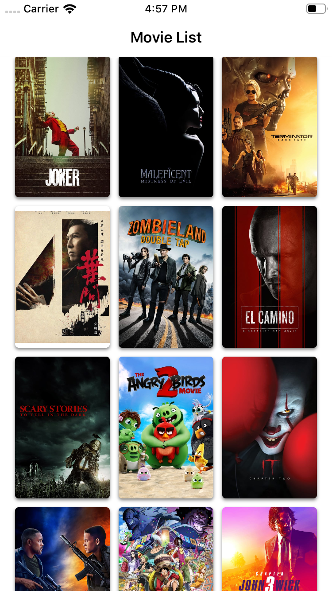
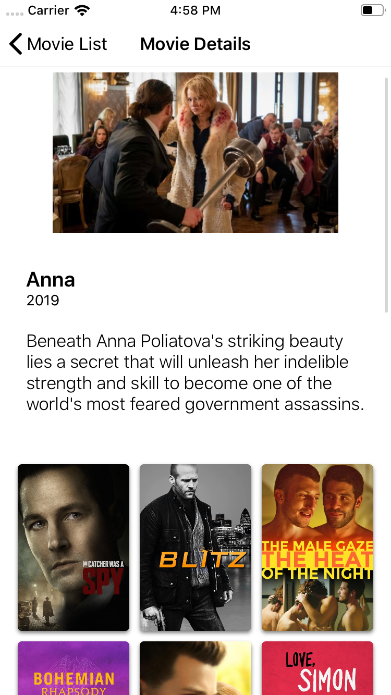

# HOOQ Code Challenge Test

# About Project 

## 1. First screen - Movie List : 
First screen shows list of `now_playing` movies.

## 2. Second screen - Movie Details: 
Second screen shows details of movie you tapped from firsrt screen. In addition to it, it also shows `Similar` kind of movies in list.
You can also tap to see details of any moview from this screen and it will push the new moview details screen.

# Architectural Information:
This project uses `MVP-Clean` architecture.

# Requirements:
* iOS 13.0+
* Xcode 11.1 +
* Swift 5+

__Note__: My intention to support `iOS 13.0+` is, I wanted to explore new `UICollectionViewLayout` API which was introduced in this year `WWDC` for making `CollectionView` much simpler and better than ever.

# ScreenShots:

